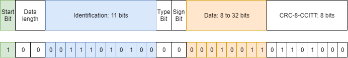
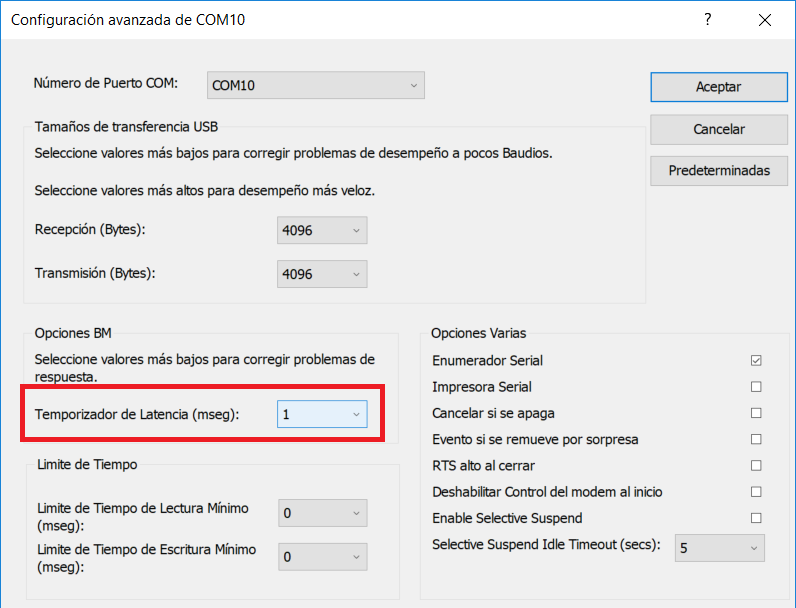
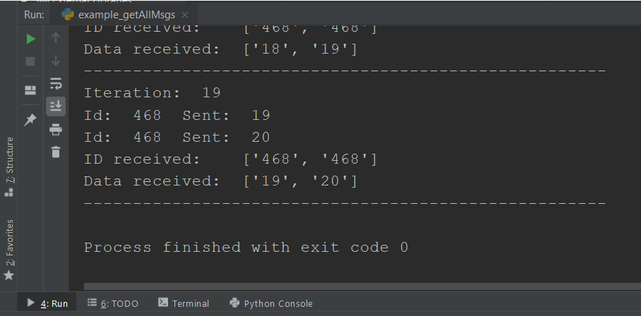
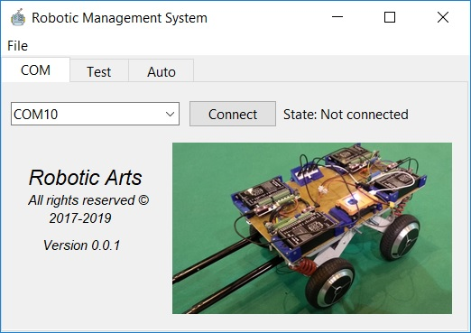
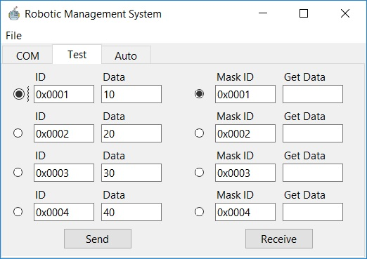
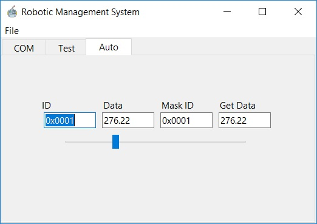

# JITBUS-Protocol

Autor: Robert Vasquez Zavaleta

*Robotic Arts, All Rights Reserved 2017-2019*

## Contenidos

* [Protocolo JITBUS] (## Introducción 📑)
  * Introducción
  * Motivación
  * Protocolo JITBUS
  * ¡Comenzando!
* Funciones del módulo JITBUS
  * Inicialización
  * Envío de mensajes
  * Recepción de mensajes
  * Recepción de mensajes con filtrado
* Interfaz JITBUS 

## Introducción 📑

Implementación de un protocolo para la comunicación por puerto serie entre dispositivos que empleen esta comunicación de forma nativa o virtual (por ejemplo, a través de un USB). El protocolo de este repositorio se ha escrito en Python y está pensado para ejecutarse en un ordenador. 

Cada una de las funciones viene acompañada de un ejemplo para comprender su utilidad. También se ha creado una interfaz para poder gestionar de forma visual la comunicación. Dicha GUI forma parte de otro proyecto más grande aún en construcción, sin embargo, es completamente funcional para comprender el funcionamiento del protocolo.

## Motivación 💪

Existen pocos protocolos de comunicación orientados a transmitir datos de sensores o actuadores a través del bus USB. Uno de sus motivos se debe a que este bus es poco determinista y está sujeto a la latencia de un ordenador que no implementa un planificador de tiempo real. No obstante, hay aplicaciones donde no es importante cumplir plazos de tiempo en donde se requiere una transmisión de datos.

El USB tiene varios perfiles (almacenamiento masivo, audio HID), se ha elegido emular un puerto serie virtual para la transmisión de datos. Este método es elegido por la gran mayoría de fabricantes cuando quieren transmitir información de sensores o actuadores en sus productos. Sin embargo, cada uno de los fabricantes termina creando su propio protocolo. Esto causa que no haya un protocolo general de comunicación y que cada persona tenga que crearse el suyo desde cero para transmitir datos. 

Existe el protocolo Modbus RTU sobre puerto serie el cual posee librerías para funcionar en un ordenador. El problema ocurre cuando se intenta migrar a un microcontrolador. Esto provoca que se tenga que volver a escribir la librería desde cero en el uC ya que nunca hay librerías Modbus para todas las arquitecturas. Ante esta situación, como igualmente tenía que escribir un protocolo, decidí crearme el mío y lo llamé protocolo JITBUS. Este protocolo está orientado principalmente a la robótica.

## Protocolo JITBUS 🔨

Ejemplo del protocolo JITBUS cuando se envía el identificador 0x1D4 y el dato 19



JITBUS significa Just In Time Bus y es un protocolo en el que se envían únicamente los datos necesarios justo a tiempo. Está basado en la estructura del protocolo CAN estándar. Dada su similitud es muy sencillo transmitir mediante JITBUS los datos recibidos de un dispositivo CAN a través de un microcontrolador para que los datos puedan ser adquiridos por el USB de un ordenador. 

Los componentes que el usuario debe tener en cuenta son la ID y el DATO. El ID representa la identificación del dispositivo al que se debe acceder. Por ejemplo, un controlador de motor que se comunique por puerto serie (nativo o virtual) puede tener asignada la dirección 0x1D4 y un controlador de leds la dirección 0xFF. Esta asignación debe ser establecida por el programador y según el dispositivo que se trate él debe considerar el DATO de una forma u otra. Por ejemplo, si el ID es del motor, el DATO se puede tratar de la velocidad (si así lo ha establecido el programador). 

### Partes del protocolo

Las partes del protocolo son las siguientes
* *Start bit:* bit que detecta el inicio de la trama
* *Data lenght:* dos bits que indican la longitud máxima del DATO en bytes (1-4 bytes)
* *Identification:* once bits que indican la identificación del dispositivo
* *Type bit:* indica si el DATO es de tipo float o entero 
* *Sign bit:* indica el signo del DATO
* *Data:* dato que se envía, su tamaño puede ser de 1,2,3 o 4 bytes
* *CRC:* verificación de redundancia cíclica de tipo CCITT

### Tipos de DATO a enviar

El dato por enviar puede ser de tipo *float* o de tipo *int*, en ambos casos el valor no será nunca superior a 32 bits. Las variables de tipo *float* son de precisión simple y ocupan siempre 4 bytes en el protocolo. Las variables de tipo *int* ocuparán 1, 2, 3 o 4 bytes en función del valor que se pretenda transmitir. No es necesario indicar de qué tipo será el dato por enviar y tampoco hay que indicar la longitud que va a ocupar, el módulo JITBUS se encarga de hacerlo automáticamente por el programador.

Por otro lado, el protocolo JITBUS tiene dedicado un bit para saber el signo del DATO. Esto significa que las variables de tipo entero pueden adquirir  valores tanto en positivo como en negativo. Los valores máximos y mínimos de las variables float se rigen por la norma IEE 754 con precision simple.

### Mejoras futuras

* Los once bits de identificación pueden partirse en 7 bits para la identificación del dispositivo y otros 4 bits para poder indicar alguna característica  del dispositivo. Por ejemplo, en el controlador de un motor, con un ID de 7 bits, se podrían señalar 16 características diferentes: velocidad, posición inicial, valores del PI, etc.

* Implementar una capa de aplicación en este protocolo que permita crear un diccionario de objetos. De esta forma cada actuador tendrá un identificador fijo que facilite la portabilidad del código.


## ¡Comenzando! :rocket:

Descarga este repositorio desde Github Web para poner en marcha todos los ejemplos. Asegúrate que el directorio en tu ordenador debe quedar de la siguiente forma:
      
* JITBUS-Protocol
   * examples
   * GUI test
   * jitbus.py
 
Abre uno de los ejemplos de la carpeta *examples*. Estos ejemplos envían la trama JITBUS, esperan la respuesta y reciben la trama en el mismo código. Por este motivo es necesario que conectes por USB un dispositivo que implemente el protocolo JITBUS para que pueda contestar. Sino dispones de ese recurso puedes emplear un chip FTDI en modo eco (loopback mode). Para ello hay que conectar el pin TX al pin RX. De esta forma la trama enviada al chip FTDI será devuelta al ordenador como si fuera un eco.
 
 

### Mejorando la latencia

Por defecto, la latencia en Windows es de 16 ms, esto hace un cuello de botella si se desean transmitir datos a gran velocidad. Para cambiar la latencia hay que ir a:

```
  * Administrador de Dispositivos -> Puerto COM (el nuestro) -> Propiedades -> Configuración del puerto -> Opciones Avanzadas 
```

⚠️ Es importante que si quieres conseguir la máxima velocidad emplees el FTDI 232RL o alguno similar del mismo fabricante. Los chips como el CH340 son más lentos ya que no se les puede modificar la latencia.




Una vez con todos los recursos necesarios ¡ejecuta el programa! Por ejemplo, el resultado para el ejemplo *example_getAllMsgs* es el siguiente:




# Funciones del módulo JITBUS

El módulo JITBUS para Python implementa las funciones necesarias para enviar y recibir los mensajes. Las funciones son:

```python
  myJitbus.open(COMport, baudrate , timeout)
  myJitbus.close()
  myJitbus.sendMsg(id, data)
  myJitbus.availableMsg()
  myJitbus.getAllMsgs()
  myJitbus.getMsg()
  myJitbus.isThereDataFromMaskId(id)
  myJitbus.getAllDataFromMaskId(id)
  myJitbus.getDataFromMaskId(id)
  myJitbus.getLastDataFromMaskId(id)
```

## Inicialización 

Ejemplo de inicialización 

```python
myJitbus = jitbus.JitbusUSB()
myJitbus.open("COM10", 3000000 , 0.00000001)
```

Se crea un objeto llamado *myJitbus* y se abre el puerto COM10 a 3 Mbits/s con un timeout pequeño

## Envío de mensajes

Mediante la siguiente función se envía la trama JITBUS. Es necesario indicar el identificador  (máximo 0x7FF) y el dato que puede ser un valor entero o decimal positivo o negativo (máximo  )

```python
myJitbus.sendMsg(id, data)
```

Ejemplo de envio de un mensaje

```python
id = 0x1D4
data = 19
myJitbus.sendMsg(id, data)
time.sleep(0.002)
```

Se envía un mensaje con identificador 0x1D4 y dato 19. Es recomendable realizar una espera de 2 ms para evitar problemas con la latencia del ordenador. Si no se realiza la pausa, los bytes recibidos por el puerto serie que no hayan sido recogidos por el USB se almacenarán en un buffer para su posterior comprobación. 

## Recepción de mensajes

Para recibir los mensajes hay que invocar la función de abajo. Esto permite leer desde el puerto serie y encontrar el mensaje entre los datos en raw recibidos desde otro dispositivo que ha enviado una trama JITBUS. Todos los mensajes correctamente recibidos se almacenarán en un buffer de 256 bytes a la espera de que sean consultados. La función devuelve el número de mensajes que existen en dicho buffer hasta el momento

```python
 if myJitbus.availableMsg() > 0:
      #Hacer cosas...
 ```
 
Cuando hay datos disponibles en el buffer la función de abajo devuelve de golpe todos los mensajes almacenados hasta el momento. Una vez que la función ha terminado los mensajes del buffer son eliminados. Si hay mas de un mensaje almacenado, las variables *getId* y *getData* se convierten en vectores.
 
 ```python
 getId, getData = myJitbus.getAllMsgs()
 ```
Si en vez de recibir todos los mensajes de golpe se desea recibirlos uno a uno se debe emplear la función de abajo. Dicha función devuelve el valor del primer mensaje almacenado en el buffer. Hay que tener en cuenta que, una vez leído el mensaje, se borrará del buffer.
 
  ```python
 getId, getData = myJitbus.getMsg()
 ```

 Ejemplo de recepcion 1 
 
 ```python
     if myJitbus.availableMsg() > 0:

        getId, getData = myJitbus.getAllMsgs()
```
  
   Ejemplo de recepcion 2
   
```python
    if myJitbus.availableMsg() > 0:

        numberOfMsgs = myJitbus.availableMsg()

        for w in range (numberOfMsgs):

            getId, getData = myJitbus.getMsg()
   
```
 
 ## Recepción de mensajes con filtrado
 
Cuando es necesario recibir la respuesta de un mensaje que tenga un identificador concreto es posible filtrar el mensaje e ignorar al resto. Para ello, basta con llamar a la función de abajo siempre y cuando haya datos disponibles en el buffer. Esta función, a partir del identificador del mensaje que se pretende encontrar, devuelve el número de mensajes que existen en el buffer con el ID indicado.

```python
if myJitbus.isThereDataFromMaskId(0x1D4) > 0:
      #Hacer cosas...
```

Cuando hay mensajes con el ID especificado, la función de abajo devuelve de golpe todos los mensajes almacenados que posean ese ID. Una vez que la función ha terminado SOLO los mensajes con ese ID del buffer son eliminados. Si hay más de un mensaje almacenado, las variables *getId* y *getData* se convierten en vectores.

```python
getId, getData = myJitbus.getAllDataFromMaskId(id)
```

Si en vez de recibir todos los mensajes con un ID especificado de golpe se desea recibirlos uno a uno se debe emplear la función de abajo. Dicha función devuelve el valor del primer mensaje almacenado en el buffer con ese ID. Hay que tener en cuenta que una vez leído ese mensaje, se borrará del buffer.

```python
getId, getData = myJitbus.getDataFromMaskId(id)
```

Normalmente, cuando se trabaja con sensores en aplicaciones de monitoreo interesa saber cuál es el valor actual de ese sensor. Debido a la latencia del USB, los datos no se envían en tiempo real por lo que se almacenan en un buffer a la espera de ser procesados. Cuando se leen los datos del buffer para un sensor en concreto puede darse el caso de que aparezcan varios valores. Por ejemplo, un sensor de velocidad podría devolver en un mismo buffer los valores 3.2 m/s ,  3.3 m/s  y 3.24 m/s. Es lógico pensar que el valor que interesa obtener es el último (3.24 m/s) ya que es el valor más reciente y el resto han llegado tarde.

Por ello, se ha implementado una función que permite obtener el último mensaje que hay en el buffer con el ID indicado. Cuando esta función termina, todos los mensajes con el ID indicado se borran del buffer.

```python
getId, getData = myJitbus.getLastDataFromMaskId(id)
```

 Ejemplo de recepción con filtrado 1

 ```python
if myJitbus.availableMsg() > 0:

      if myJitbus.isThereDataFromMaskId(0x1D4) > 0:

            getId, getData = myJitbus.getAllDataFromMaskId(0x1D4)
 ```

 Ejemplo de recepción con filtrado 2 
 
 ```python
 if myJitbus.availableMsg() > 0:

      numberOfMsgsWithID = myJitbus.isThereDataFromMaskId(0x1D4)

      for w in range (numberOfMsgsWithID):

            getId, getData = myJitbus.getDataFromMaskId(0x1D4)
```

Ejemplo de recepción con filtrado 3 

  ```python
if myJitbus.availableMsg() > 0:

      if myJitbus.isThereDataFromMaskId(0x1D4) > 0:

            getId, getData = myJitbus.getLastDataFromMaskId(0x1D4)
 ```

# Interfaz JITBUS

Por último, es posible ejecutar la interfaz de ejemplo para poder comunicarse con dispositivos que implementen el protocolo JITBUS de forma visual. Este programa forma parte de un proyecto más grande que aún no está acabado sin embargo es útil para comprobar que los dispositivos JITBUS funcionan correctamente.

La interfaz tiene tres pestañas. La primera de todas sirve para conectarse con el dispositivo con el que realizar la comunicación:



La segunda pestaña permite enviar y recibir los mensajes. Hay que indicar el ID y el dato a enviar y pulsar el botón. Por otro lado, el botón de recibir leerá el último dato que haya en buffer y lo mostrará por pantalla. A partir de los checkbutton es posible indicar qué casilla enviará y recibirá el mensaje.



La tercera pantalla permite enviar y recibir datos simultáneamente. Los mensajes se envían cada vez que el valor de la barra cambia y a su misma vez se comprueban si hay mensajes disposibles para mostrarlos.



