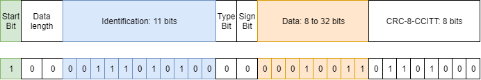

# JITBUS-Protocol

## Introducción

Implementación de un protocolo para la comunicación por puerto serie entre dispositivos que empleen esta comunicación de forma nativa o virtual (por ejemplo a través de un USB). El protocolo de este repositorio se ha escrito en Python y está pensado para ejecutarse en un ordenador. 

Cada una de las funciones viene acompañada de un ejemplo para comprender su utilidad. También se ha creado una interfaz para poder gestionar de forma visual la comunicación. Dicha GUI forma parte de otro proyecto más grande aún en construcción, sin embargo es completamente funcional para comprender el funcionamiento del protocolo.

## Motivación

Exiten pocos protocolos de comunicación orientados a transmisir datos de sensores o actuadores a través del bus USB. Uno de sus motivos se debe a que este bus es poco determinista y está sujeto a la latencia de un ordenador que no implementa un planificador de tiempo real. No obstante, hay aplicaciones donde no es importante cumplir plazos de tiempo en donde se requiere una transmisión de datos.

El USB tiene varios perfiles (almacenamineto masivo, audio HID), se ha elegido emular un puerto serie virtual para la transmisión de datos. Este método es elegido por la gran mayoria de fabricantes cuando quieren transmisitir información de sensores o actuadores en sus productos. Sin embargo, cada uno de los fabricantes termina creando su propio protocolo. Esto causa que no haya un protocolo general de comunicación y que cada persona tenga que crearse el suyo desde cero para transmitir datos. 

Existe el protocolo Modbus RTU sobre puerto serie el cual posee librerias para funcionar en un ordenador. El problema ocurre cuando se intenta migrar a un microcontrolador. Esto provoca que se tenga que volver a escribir la libreria desde cero en el uC ya que nunca hay librerias Modbus para todas las arquitecturas. Ante esta situación, como igualmente tenia que escribir un protocolo, decidí crearme el mio y lo llamé protocolo JITBUS. Este protocolo esta orientado principalmente a la robótica.

## Protocolo JITBUS

Ejemplo del protocolo JITBUS cuando se envia el identificador 0x1D4 y el dato 19

JITBUS significa Just In Time Bus y es un protocolo en el que se envian unicamente los datos necesarios justo a tiempo. Esta basado en la estructura del protocolo CAN estándar. Dada su similitud es muy sencillo transmitir mediante JITBUS los datos recibidos de un dispositivo CAN a traves de un microcontrolador para que los datos puedan ser adquiridos por el USB de un ordenador. 

Los componentes que el usuario debe tener en cuenta son la ID y el DATO. El ID representa la identificación del dispositivo al que se debe acceder. Por ejemplo un controlador de motor que se comunique por puerto serie (nativo o virtual) puede tener asignada la direccion 0x1D4 y un controlador de leds la direccion 0xFF. Esta asigación debe ser establecidad por el programador y según el dispositivo que se trate él debe considerar el DATO de una forma u otra. Por ejemplo, si el ID es del motor, el DATO se puede tratar de la velocidad (si asi lo ha establecido el programador). 

Las partes del protocolo son las siguientes
* Start bit: bit que detecta el inicio de la trama
* Data lenght: dos bits que indican la longitud máxima del DATO en bytes (1-4 bytes)
* Identification: once bits que indican la identificacion del dispositivo
* Type bit: indica si el DATO es de tipo float o entero 
* Sign bit: indica el signo del DATO
* Data: dato que se envia, su tamaño puede ser de 1,2,3 o 4 bytes
* CRC: verificación de redundancia cíclica de tipo CCITT

## ¡Comenzando!

Descarga este repositorio desde Github Web para poner en marcha todos los ejemplos. Asegurate que el directorio en tu ordenador debe quedar de la siguiente forma:
      
* MiProyecto
   * examples
   * GUI test
   * jitbus.py
           

       

 Implementation of a protocol for communication between USB devices through a virtual serial port
